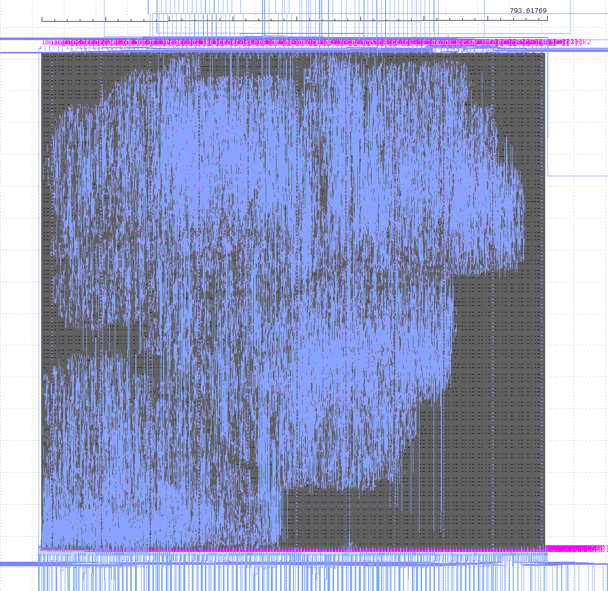
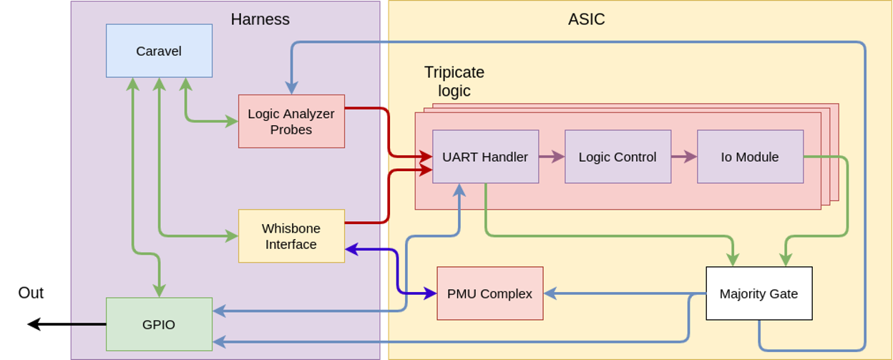
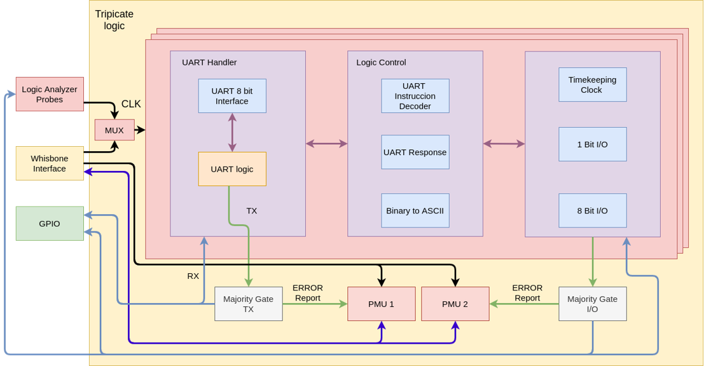
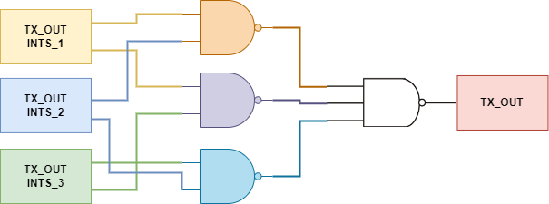

# **Space Controller**

 

## **Authors**
- Ivan Rodriguez-Ferrandez (UPC¹-BSC²)
- Alvaro Jover-Alvarez (UPC¹-BSC²)
- Leonidas Kosmidis (BSC²-UPC¹)
- David Steenari (ESA³)
 
¹ Universitat Politècnica de Catalunya (UPC)  
² Barcelona Supercomputing Center (BSC)  
³ European Space Agency (ESA)

<!--  -->

### **Main Version of the chip: 1.0V**  

 

## **Change Log**

- Version 1.0V:
  - TODO 

## **Chip Layout**
<!---->

## **Description**
This design is a radiation tolerant UART server that can be used for low level control of multiple input/output ports during a radiation testing campaign. The system features triple redundancy in order to ensure that the commands are properly executed.  

In addition to simulation, the RTL design of the user project is verified also on a Xilinx Zybo Z7-20 FPGA using Vivado.
The UART communication protocol is based on [https://github.com/alexforencich/verilog-uart](https://github.com/alexforencich/verilog-uart) and its [files](https://github.com/jaquerinte/space_controller/tree/main/verilog/rtl/controller/UART_SERVER) are covered with the same open source license as the rest of the project (MIT).

## **How To Use The Chip**
This chip uses the UART port for main communication. This communication port is used to send instructions and receive the requested output. 
The input is a 52 bit word for communication. In order to fill up the word, the values are sent one by one via the UART port.
The 52 bit are divided in this well defined sections:
- [51:49] 3 bit operation code.
- [48:44] 5 bit primary register operation. 
- [43:0]  44 bit auxiliary values.

As commented, the communication is through the UART port, and each 4 bits are encoded in hex. Since UART uses the ASCII table for the characters, the following list shows the mapping between the ASCII characters and the hex value interpreted by the chip:

- 1 ➜ 1
- 2 ➜ 2
- 3 ➜ 3
- 4 ➜ 4
- 5 ➜ 5
- 6 ➜ 6
- 7 ➜ 7
- 8 ➜ 8
- 9 ➜ 9
- : ➜ A
- ; ➜ B
- < ➜ C
- = ➜ D
- \> ➜ E  
- ? ➜ F

The sent data is buffered in a shift register, so in order to denote the end of the command, the ASCII character **0D** (New line) needs to be sent. If you want to clear the buffered instruction, you can send the ASCII character **20** (Space), which clears the shift register. 
### **Instruction Set**

#### **IWrite instructions**
| Type  | Description | OP Code [51:49] | Primary Register [48:44] | Auxillary [43:0] |
|--|---|---|---|---|
| IWrite | Writes a logic 1 in the selected register  and is maintains it for the number of cycles denoted by the value of the **Auxillary** field. | 000 | register | cycles |
| IWrite | Waits 1 Second and writes a logic 1 in  the selected selected register. The value is  maintained for a number of cycles denoted by the **Auxillary** field. | 001 | register | cycles |

  

#### **IRead instructions**
| Type  | Description | OP Code [51:49] | Primary Register [48:44] | Auxillary [43:0] |
|---|---|---|---|---|
| IRead | Reads the logic value in the selected register  and the read is delayed by **Auxiliary** number of cycles. | 100 | register | cycles |

  

#### **BWrite instructions**
| Type  | Description | OP Code [51:49] | Primary Register [48:44] | Auxillary [43:0] |
|---|---|---|---|---|
| BWrite | Writes 8 bit value during one clock cycle.  The register and value are specified in the **Auxiliary** field. | 011 | sel register 7 | [43:39] sel register 6   [38:34] sel register 5   [33:29] sel register 4   [28:24] sel register 3   [23:19] sel register 2   [18:13] sel register 1   [13:9] sel register 0   [8] not used  [7:0] value for the registers|
| BWrite | Waits 1 second and writes 8 bit value during one second.  The register and value are specified in the **Auxiliary** field. | 111 | sel register 7 | [43:39] sel register 6   [38:34] sel register 5   [33:29] sel register 4   [28:24] sel register 3   [23:19] sel register 2   [18:13] sel register 1   [13:9] sel register 0   [8] not used  [7:0] value for the registers|

  

#### **BRead instructions**
| Type  | Description | OP Code [51:49] | Primary Register [48:44] | Auxillary [43:0] |
|---|---|---|---|---|
| BRrite | Reads  8 bit value during one clock cycle.  The register and value are specified in the **Auxiliary** field. | 011 | sel register 7 | [43:39] sel register 6   [38:34] sel register 5   [33:29] sel register 4   [28:24] sel register 3   [23:19] sel register 2   [18:13] sel register 1   [13:9] sel register 0   [8:0] not used|

## **Block Description**

## **Triple Redundancy Implementation**
As mention previously this deign is targeted for a safety critical systems, with radiations environments. There are two possible routes to take for ensuring that a result is correct in this scenarios, first is to add parity checkers in order to verify that a bit flip has not happen, we explore that solution ECC, in  [Space Shuttle](https://github.com/jaquerinte/caravel_radiation_harden/). This solution can detect and correct a single bit flip or detect a double bit flip, but this could cause to need to re-do a computation, or some extra operation that could cause that we miss a critical deadline.

Another solution is the triplication of a module. This allows us to guaranty that and error happening in one unit will not change the output, and there fiscally different circuits doing the operation. The main drawback of this approach is the extra space  and power that is needed in order to two more replication of the system.

For this project all of the computation is triplicated, so the UART handler, logic control and IO module have separate instances. So how this implemented in verilog can be seen in the file [main_module.v](https://github.com/jaquerinte/space_controller/blob/main/verilog/rtl/controller/main_module.v), in this file we generate three instances of the [control_module.v](https://github.com/jaquerinte/space_controller/blob/main/verilog/rtl/controller/control_module.v). FOr the input is simple in verilog we only need to feed each of the modules with the require inputs, for example the "rx" wire from the UART, and the input signals from the GPIO.

With that each module will process a request and produce and output to the "tx" and/or in the GPIO signals. In order to detect if an error happen we need to implement a majority vote, this means that if two signals agree in one value, that value will be the correct one, independent that the third agrees or not. In order to implement this we use a series of **NAND** gates to create the majority vote as shown  in the following figure.

Another option if using the SkyWater 130 nm PDK is to the [maj3](https://antmicro-skywater-pdk-docs.readthedocs.io/en/test-submodules-in-rtd/contents/libraries/sky130_fd_sc_hd/cells/maj3/README.html) to reduce the number of cells use.

With that we implemented the majority vote, but also in our project is require to monitor when an error is detected, meaning that one of the three modules disagrees or the three have a complete different value. For that 

## **Module Ports**:
- **Input Ports**
- **Output Ports**

## **Caravel Connections**

### **GPIO Connections**

### **Logic Analyzer Probes**
- Input probes: 
  
- Output probes:

### **Wishbone Connection**

## **Description of the Modules**

### **Module List**

## **Wishbone Description**

 ### **Memory Map**

 ### **Software Example**

## **Available Tests**
